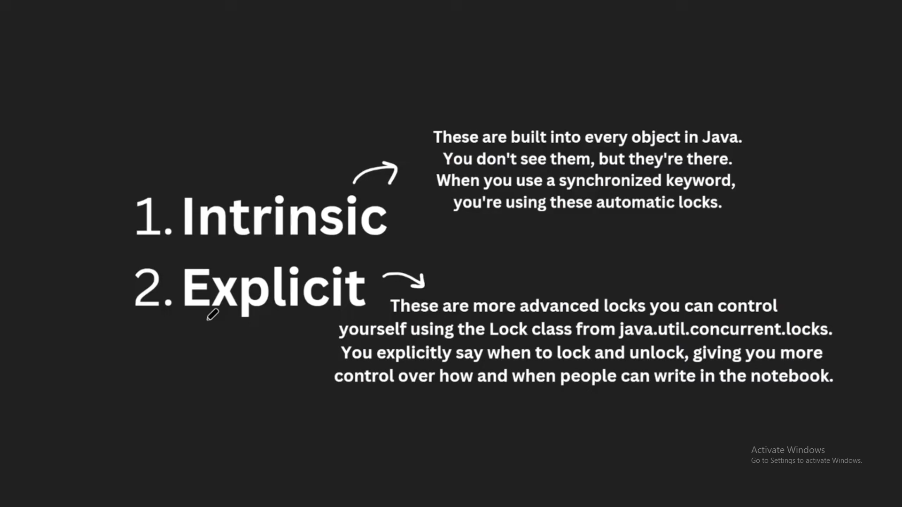
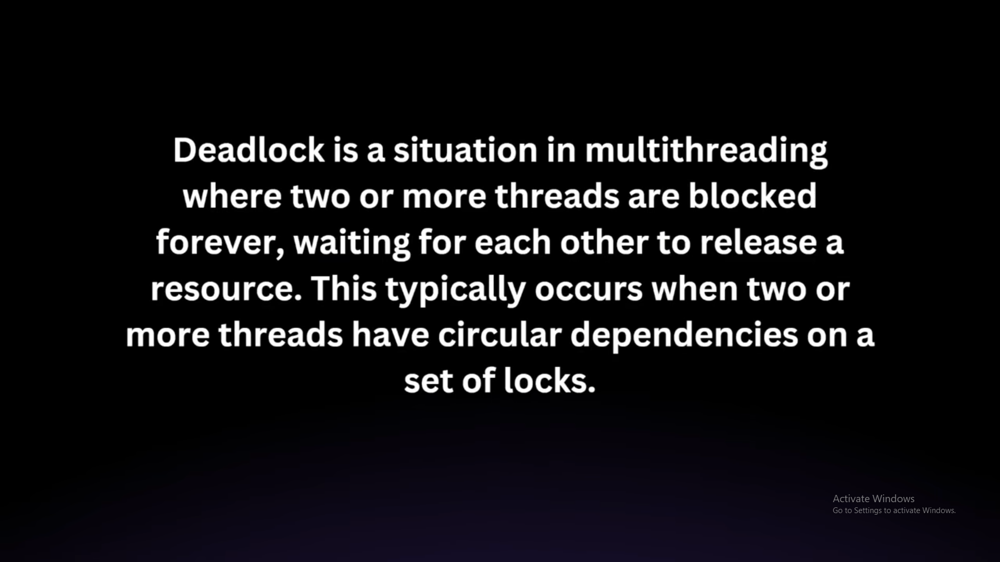
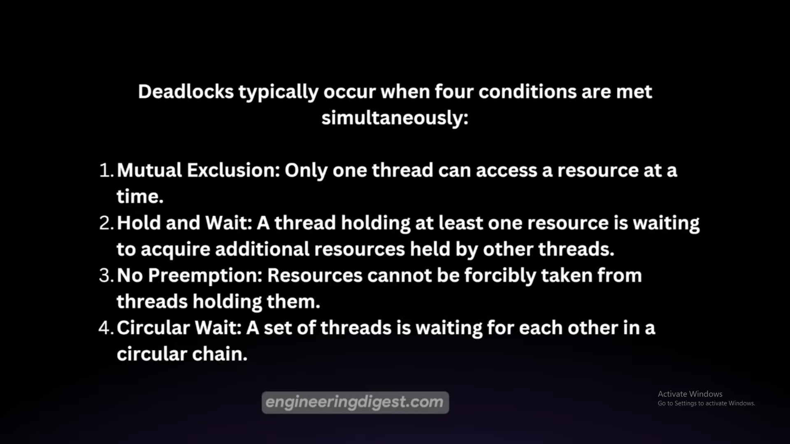
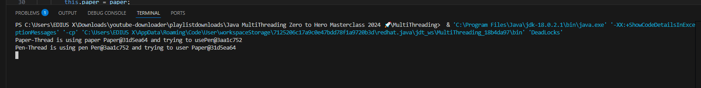

#

### Java Locks
- There are 2 type of locking in java:
  - Intrinsic and 
  - Extrinsic
  - 
  - Using Synchronized can block the thread but in this meanwhile other threads can't access. Let's say, one thread is entered but it is taking lot more time to execute. Until then other thread won't access, but now I want other process to get execute.
  - ReentrantLock methods:
    - lock
    - tryLock
    - unlock
    - dead lock prevention
    - lockInterruptibly
    - fairness
    - With Synch, there is
      - no fairness
      - indefinite blocking
      - no interruptibility
      - not able to differntiate read/write locking
  - Dead locks:
    - 
    - 
    - 