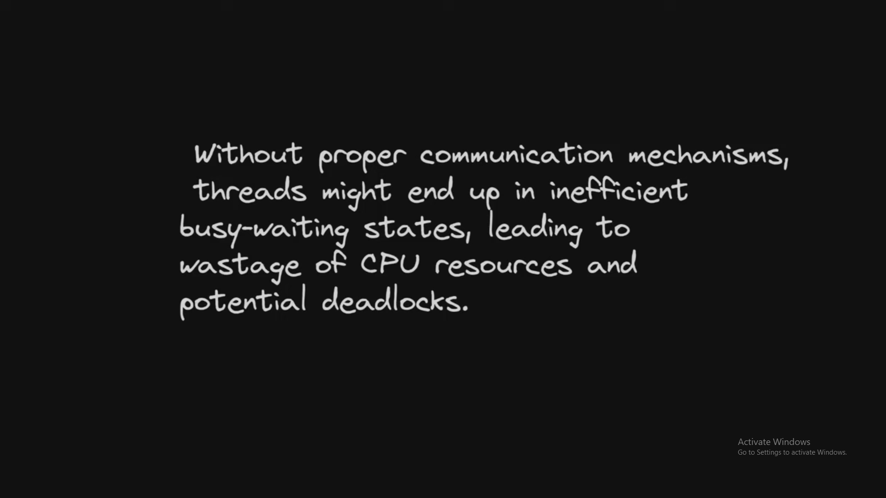
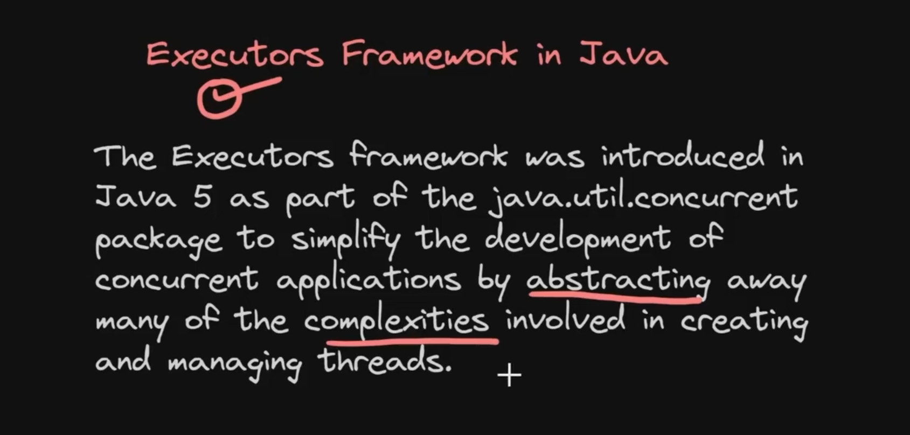

#


### Java Locks
- There are 2 type of locking in java:
  - Intrinsic and 
  - Extrinsic
  - 
  - Using Synchronized can block the thread but in this meanwhile other threads can't access. Let's say, one thread is entered but it is taking lot more time to execute. Until then other thread won't access, but now I want other process to get execute.
  - ReentrantLock methods:
    - lock
    - tryLock
    - unlock
    - dead lock prevention
    - lockInterruptibly
    - fairness
    - With Synch, there is
      - no fairness
      - indefinite blocking
      - no interruptibility
      - not able to differntiate read/write locking
  - Dead locks:
    - 
    - 
    - 
### Thread Communication




- Code:
  ```
  package coding.thread_communication;

  // Shared Resource is a resource which will be shared between many resourses.
  class SharedResource {
      private int data;
      private boolean hasData;

      public synchronized void produce(int value) {
          while (hasData) {
              try {
                  wait();
              } catch (InterruptedException e) {
                  Thread.currentThread().interrupt();
              }
          }
          data = value;
          hasData = true;
          System.out.println("Produced value is: " + value);
          notify();
      }

      public synchronized int consume() {
          while (!hasData) {
              try {
                  wait();
              } catch (InterruptedException e) {
                  Thread.currentThread().interrupt();
              }
          }
          hasData = false;
          notify();
          System.out.println("Produced value is: " + data);
          return data;
      }
  }

  class Producer implements Runnable {
      SharedResource sharedResource;

      public Producer(SharedResource sharedResource) {
          this.sharedResource = sharedResource;
      }

      @Override
      public void run() {
          for (int i = 0; i < 10; i++) {
              sharedResource.produce(i);
          }
      }

  }

  class Consumer implements Runnable {
      SharedResource sharedResource;

      public Consumer(SharedResource sharedResource) {
          this.sharedResource = sharedResource;
      }

      @Override
      public void run() {
          for (int i = 0; i < 10; i++) {
              sharedResource.consume();
          }
      }

  }

  public class ThreadCommunication {
      public static void main(String[] args) {
          SharedResource sharedResource = new SharedResource();
          Thread producerThread = new Thread(new Producer(sharedResource));
          Thread consumerThread = new Thread(new Consumer(sharedResource));

          producerThread.start();
          consumerThread.start();
      }
  }
  ```
  - Notes:
    - Shared Resource is a resource which will be shared between many resourses. It has 2 methods produce and consume. 
    - If class has data, we are interrupted when when try to produce further and vice-versa for consume.
    - If data is not there, then we assign data and notify other thread to do further.
  
### Thread Safety:
- A thread is called safe when it guarantees that 
  - no unexpected results would come and 
  - no race conditions when multi-threads access the same object.

### Thread Pool
- Thread pool is a collection of pre-initialized threads.
- Why?
  - **Resource management** is easy.
  - **Response time will come down** since creation & destruction of threads is done at first time rather than doing every time.
  - **Control over thread count:** We can mention the thread count we need.


### Java Executor Framework:

- Problems prior to Executor Framework:
  - Manual thread management.
  - Resource management.
  - Scalability.
  - Thread re-use.
  - Error handling.
- Core interfaces in Executor Framework are:
  - Executors & ExecutorService
  - ScheduledExecutorService
#### Executors & ExecutorService
- Let's say I am looping for 1 to 9 and finding factorial. Along with that I kept wait of 1000 ms, then it will take around 10 seconds.
  ```
  // Normal method
  long startTime = System.currentTimeMillis();
  int n = 9;
  for (int i = 1; i <= n; i++) {
    long rslt = factorial(i);
    System.out.println("Factorial of " + i + " is: " + rslt);
  }
  System.out.println("Total time for execution is: " + (System.currentTimeMillis() - startTime));
  ```
  ```
  Output: 
   * Factorial of 1 is: 1
   * Factorial of 2 is: 2
   * Factorial of 3 is: 6
   * Factorial of 4 is: 24
   * Factorial of 5 is: 120
   * Factorial of 6 is: 720
   * Factorial of 7 is: 5040
   * Factorial of 8 is: 40320
   * Factorial of 9 is: 362880
   * Total time for execution is: 9082
  ```
- If I use Thread class and create thread array and do join and all, it will finish in 1 second. 
  ```
  long startTime = System.currentTimeMillis();
  int n = 9;
  Thread[] threads = new Thread[9];
  for (int i = 1; i <= n; i++) {
      int finalI = i;
      threads[i - 1] = new Thread(() -> {
          long rslt = factorial(finalI);
          System.out.println("Factorial of " + finalI + " is: " + rslt);
      });
      threads[i - 1].start();
  }

  for (Thread thread : threads) {
      try {
          thread.join();
      } catch (InterruptedException e) {
          Thread.currentThread().interrupt();
      }
  }
  System.out.println("Total time for execution is: " + (System.currentTimeMillis() - startTime));
  ```
  ```
  Output:
   * Factorial of 9 is: 362880
   * Factorial of 2 is: 2
   * Factorial of 4 is: 24
   * Factorial of 3 is: 6
   * Factorial of 1 is: 1
   * Factorial of 6 is: 720
   * Factorial of 5 is: 120
   * Factorial of 8 is: 40320
   * Factorial of 7 is: 5040
   * Total time for execution is: 1029
  ```
- So I can attain asynch task but thread creation is going manually. But with **Executors**, this thread creation will be handled automatically.
  ```
  long startTime = System.currentTimeMillis();
  int n = 9;
  ExecutorService executor = Executors.newFixedThreadPool(n);
  for (int i = 1; i <= n; i++) {
      int finalI = i;
      executor.submit(() -> {
          long rslt = factorial(finalI);
          System.out.println("Factorial of " + finalI + " is: " + rslt);
      });
  }
  executor.shutdown();
  System.out.println("Total time for execution is: " + (System.currentTimeMillis() - startTime));
  ```

  ```
  Output:
   * Factorial of 7 is: 5040
   * Factorial of 4 is: 24
   * Factorial of 8 is: 40320
   * Factorial of 9 is: 362880
   * Factorial of 2 is: 2
   * Factorial of 1 is: 1
   * Factorial of 3 is: 6
   * Factorial of 6 is: 720
   * Factorial of 5 is: 120
   * Total time for execution is: 1038
  ```
- Executors implements Excecute. So above code can also be written like:
  ```
  Executor executor = Executors.newFixedThreadPool(n);
  for (int i = 1; i <= n; i++) {
      int finalI = i;
      executor.execute(() -> {
          long rslt = factorial(finalI);
          System.out.println("Factorial of " + finalI + " is: " + rslt);
      });
  }
  ```
  - So here instead of **submit**, we have to use **execute** method coming from **Executor** class.
- Callable, Runnable, Runnable & Result, Future:
  - Runnable:
    1. method is run
    2. no throw, so try catch is needed 
    3. no return type
    ```
    Runnable runnable = () -> System.out.println("Runnable method");
    ExecutorService runWay = Executors.newSingleThreadExecutor();
    Future<?> futureRW = runWay.submit(runnable);   // Runnable method
    System.out.println(futureRW.get());     // null
    ```
  - Callable:
    1. Method is call
    2. By default, **Exception** is thrown.
    3. There is return type.
    ```
    Callable<String> cb = () -> "Callable Method";
    ExecutorService cbWay = Executors.newSingleThreadExecutor();
    Future<String> futureCB = cbWay.submit(cb);
    System.out.println(futureCB.get());     // Callable Method
    ```
  - Runnable & Result:
    1. executor takes runnable and result as parameters.
    ```
    Future<String> runResult = runAndResult.submit(()-> System.out.println("Runnable in run and result"), "Task is finished"); // Runnable in run and result
    System.out.println(runResult.get());     // Task is finished
    ```
- shutdown & shutdownNow, isShutdown, isTerminated:
  - execute.shutdown() 
    - stops the process after all tasks are done, if we don't execute cursor won't get return. We have to close manually.
  - execute.shutdownNow()
    - Attempts to stop all actively executing tasks, halts the processing of waiting tasks, and returns a list of the tasks that were awaiting execution.
  - execute.isShutdown():
    - it return true/false as per execute is shutdown or not.
  - execute.isTerminated():
    - When it is shutdown, it takes time to terminate all the processes and all. So returning true from this means all processes are terminated.
      ```
      runAndResult.shutdown(); 
      System.out.println(runAndResult.isShutdown());   // true
      Thread.sleep(1);
      System.out.println(runAndResult.isTerminated());   // true with above Thread.sleep(), else false because it takes time.
      ```

#### ScheduledExecutorService:
- ```ScheduledExecutorService schedular = Executors.newScheduledThreadPool(1);```
- schedule, scheduleAtFixedRate & scheduleWithFixedDelay:
  - **schedule**:
    - performs task after given time. With below code snippet, schedule is terminated after 10 seconds.
    ```
    schedular.schedule(() -> {
        System.out.println("Intializing timeout...!");
        schedular.shutdown();
    }, 10, TimeUnit.SECONDS); 

    schedular.scheduleAtFixedRate(TASK, delay, TimeUnit);
    ``` 
  - **scheduleAtFixedRate**:
    - Might task takes more than 2 seconds. It runs again even if before task is running.
    ```
    schedular.scheduleAtFixedRate(() -> System.out.println("Task executed at every 5 seconds"), 2, 2, TimeUnit.SECONDS); 
    schedular.scheduleAtFixedRate(TASK, intitalDelay, period, TimeUnit);
    ``` 
  - **scheduleWithFixedDelay**:
    - Might task takes more than 2 seconds. It wait until that task finishes and then takes 2 seconds delay and then run again
    ```
    schedular.scheduleWithFixedDelay(() -> System.out.println("Task with fixed delay executed at every 5 seconds"), 2, 2, TimeUnit.SECONDS); 
    schedular.scheduleWithFixedDelay(TASK, intialDelay, Delay, TimeUnit); 
    ``` 
#### Cache Thread pool:
- We can create multiple threads like ```ExecutorService executor = Executors.newFixedThreadPool(9);``` or single thread like ```ExecutorService executor = Executors.newSingleThreadExecutor()```. So here if we know number of thread we need, then we can use above ways. But if we dunno about how many processes might run and all, in such situation, we can use cache thread pool.
```
ExecutorService cache = Executors.newCachedThreadPool();
```
- Advantages:
  - It creates & destroys the threads as per the requirements automatically.
  - Here thread count is not in our hands.

#### CountDownLatch:
- Problem:
  ```
  ExecutorService executorService = Executors.newFixedThreadPool(3);
  Future<String> future1 = executorService.submit(new DependentService());
  Future<String> future2 = executorService.submit(new DependentService());
  Future<String> future3 = executorService.submit(new DependentService());

  future1.get();
  future2.get();
  future3.get();
  System.out.println("All dependent services are finished. Starting main service...");
  executorService.shutdown();


  class DependentService implements Callable<String> {

    @Override
    public String call() throws Exception {
        System.out.println(Thread.currentThread().getName() + " service started...");
        return "Ok";
    }
  }
  ```
  ```
   /*
    * pool-1-thread-1 service started...
    * pool-1-thread-3 service started...
    * pool-1-thread-2 service started...
    * All dependent services are finished. Starting main service...
    */
  ```
  - Here **future.get()** has been used to wait to get the tasks finish. This can be done by **CountDownLatch** which helps to make await in one go.
  ```
  class DependentServiceWithLatch implements Callable<String> {

    private final CountDownLatch latch;

    public DependentServiceWithLatch(CountDownLatch latch) {
        this.latch = latch;
    }

    @Override
    public String call() throws Exception {
        try {
            System.out.println(Thread.currentThread().getName() + " service started...");
            Thread.sleep(2000);
        } finally {
            latch.countDown();
        }
        return "Ok";
    }

  }

  // With Latch
  System.out.println("-------------------->LATCH<--------------------");
  int count = 3;
  ExecutorService executorServiceWithLatch = Executors.newFixedThreadPool(count);
  CountDownLatch latch = new CountDownLatch(count);
  executorServiceWithLatch.submit(new DependentServiceWithLatch(latch));
  executorServiceWithLatch.submit(new DependentServiceWithLatch(latch));
  executorServiceWithLatch.submit(new DependentServiceWithLatch(latch));
  latch.await();
  System.out.println("Latch All dependent services are finished. Starting main service...");
  executorServiceWithLatch.shutdown();
  System.out.println("-------------------->LATCH<--------------------");

  -------------------->LATCH<--------------------
  pool-2-thread-1 service started...
  pool-2-thread-2 service started...
  pool-2-thread-3 service started...
  Latch All dependent services are finished. Starting main service...
  -------------------->LATCH<--------------------
  ```
- latch can be created using Thread and Runnable also:
  ```
  class DependentServiceWithRunnable implements Runnable {

    private final CountDownLatch latch;

    public DependentServiceWithRunnable(CountDownLatch latch) {
        this.latch = latch;
    }

    @Override
    public void run() {
        try {
            Thread.sleep(6000);
            System.out.println(Thread.currentThread().getName() + " service started...");
        } catch (Exception e) {

        } finally {
            latch.countDown();
        }
    }
  }

  // With Latch and Runnable
  System.out.println("-------------------->Latch and Runnable<--------------------");
  CountDownLatch executorServiceWithLatchRunnable = new CountDownLatch(count);
  for (int i = 0; i < count; i++) {
      new Thread(new DependentServiceWithRunnable(executorServiceWithLatchRunnable)).start();
  }
  // executorServiceWithLatchRunnable.await();
  executorServiceWithLatchRunnable.await(5, TimeUnit.SECONDS);
  System.out.println("LatchAndRunnable All dependent services are finished. Starting main service...");
  System.out.println("-------------------->Latch and Runnable<--------------------");

   /*
    * 
    * executorServiceWithLatchRunnable.await();
    * -------------------->Latch and Runnable<--------------------
    * Thread-2 service started...
    * Thread-1 service started...
    * Thread-0 service started...
    * LatchAndRunnable All dependent services are finished. Starting main
    * service...
    * -------------------->Latch and Runnable<--------------------
    */

   /*
    * executorServiceWithLatchRunnable.await(5, TimeUnit.SECONDS);
    * 
    * -------------------->Latch and Runnable<--------------------
    * LatchAndRunnable All dependent services are finished. Starting main
    * service...
    * -------------------->Latch and Runnable<--------------------
    * Thread-2 service started...
    * Thread-0 service started...
    * Thread-1 service started...
    */
  ```
- Here **latch.await()**
  - with **no parameters** make all thread to finish and then main thread gets executed.
  - With **paramters** viz., timeout and units, i.e after mentioned timeout, it stops awaiting and goes to main thread but the processes goes in background.


#### Cyclic Barrier:
- Here all the threads comes to a point **barrier.await()** and then all threads release at once.
  ```
  package executor_framework;

  import java.util.concurrent.Callable;
  import java.util.concurrent.CyclicBarrier;
  import java.util.concurrent.ExecutorService;
  import java.util.concurrent.Executors;

  public class CyclicBarrierClass {
      public static void main(String[] args) {
          int count = 3;
          ExecutorService executor = Executors.newFixedThreadPool(count);
          CyclicBarrier barrier = new CyclicBarrier(count, () -> System.out.println("System is up and running."));
          executor.submit(new DependentService(barrier));
          executor.submit(new DependentService(barrier));
          executor.submit(new DependentService(barrier));
          System.out.println("Main");
          executor.shutdown();

          /*
          * Main
          * pool-1-thread-1 service started...
          * pool-1-thread-2 service started...
          * pool-1-thread-3 service started...
          * pool-1-thread-1 is waiting at the barrier.
          * pool-1-thread-2 is waiting at the barrier.
          * pool-1-thread-3 is waiting at the barrier.
          * 
          * 
          * With
          * CyclicBarrier barrier = new CyclicBarrier(count, ()->
          * System.out.println("System is up and running."));
          * 
          * Main
          * pool-1-thread-3 service started...
          * pool-1-thread-1 service started...
          * pool-1-thread-2 service started...
          * pool-1-thread-1 is waiting at the barrier.
          * pool-1-thread-3 is waiting at the barrier.
          * pool-1-thread-2 is waiting at the barrier.
          * System is up and running.
          */
      }
  }

  class DependentService implements Callable<String> {

      private final CyclicBarrier barrier;

      public DependentService(CyclicBarrier barrier) {
          this.barrier = barrier;
      }

      @Override
      public String call() throws Exception {
          System.out.println(Thread.currentThread().getName() + " service started...");
          Thread.sleep(2000);
          System.out.println(Thread.currentThread().getName() + " is waiting at the barrier.");
          barrier.await();
          return "Ok";
      }

  }
  ```
  - Note:
    - Cyclic barrier won't block the main thread.

### CompletableFuture:
- introduced in **Java 8**. It helps in handling asynchronous operations.
- Handling one at once:
  ```
  CompletableFuture<String> f1 = CompletableFuture.supplyAsync(() -> {
      try {
          Thread.sleep(5000);
          System.out.println("F1-Thread-1");
      } catch (Exception e) {
      }
      return "F1-ok";
  });
  System.out.println("Main");

  // Initiating single one:
  try {
      System.out.println(f1.get());
  } catch (InterruptedException | ExecutionException e) {
  }

  Output:
  F1-Thread-1
  F1-ok
  Main
  ```
- Handling multiple at once:
  ```
  CompletableFuture<String> f2 = CompletableFuture.supplyAsync(() -> {
      try {
          Thread.sleep(5000);
          System.out.println("F2-Thread-2");
      } catch (Exception e) {
      }
      return "F2-Ok";
  });
  CompletableFuture<String> f3 = CompletableFuture.supplyAsync(() -> {
      try {
          Thread.sleep(5000);
          System.out.println("F3-Thread-1");
      } catch (Exception e) {
      }
      return "F3-Ok";
  });
  // Initiating many at a time.
  CompletableFuture<Void> joinFuture = CompletableFuture.allOf(f2, f3);
  joinFuture.join();
  System.out.println(f2.get());
  System.out.println(f3.get());
  System.out.println("Main");

  Output:
  F2-Thread-2
  F3-Thread-3
  F2-Ok
  F3-Ok
  Main
  ```
  - Here in **CompletableFuture<Void>**, void is because it mentions that tasks are finished but to get value of them , use f2.get() like that only.
- Blocking at first step using .get():
  ```
  try {
      String f4 = CompletableFuture.supplyAsync(() -> {
          try {
              Thread.sleep(5000);
              System.out.println("F4-Thread-4");
          } catch (Exception e) {
          }
          return "F4-ok";
      }).get();
      System.out.println(f4);
  } catch (InterruptedException | ExecutionException e) {
      e.printStackTrace();
  }
  System.out.println("Main");

  Output:
  F4-Thread-4
  F4-ok
  Main
  ```
  - here .get() blocks the code.
- Callback kind of:
  ```
  CompletableFuture<String> f5 = CompletableFuture.supplyAsync(() -> {
      try {
          Thread.sleep(5000);
          System.out.println("F5-Thread-5");
      } catch (Exception e) {
      }
      return "F5-ok";
  }).thenApplyAsync(x -> x + " || " + x);
  try {
      System.out.println(f5.get());
  } catch (InterruptedException | ExecutionException e) {
      e.printStackTrace();
  }
  System.out.println("Main");

  Output:
  F5-Thread-5
  F5-ok || F5-ok
  Main
  ```
  - here **thenApplyAsync** takes one function and have parameter equals to data returning and performs and returns. Here x = F5-ok

- Timeout with no exception handling:
  ```
  // timeout
  CompletableFuture<String> f6 = CompletableFuture.supplyAsync(() -> {
      try {
          Thread.sleep(5000);
          System.out.println("F6-Thread-6");
      } catch (Exception e) {
      }
      return "F6-ok";
  }).orTimeout(1, TimeUnit.SECONDS)
  ```
  - It throws an exception if f6 is not resolved in 1 second as given in **orTimeout**.
- Timeout with exception handling:
  ```
  // timeout
  CompletableFuture<String> f6 = CompletableFuture.supplyAsync(() -> {
      try {
          Thread.sleep(5000);
          System.out.println("F6-Thread-6");
      } catch (Exception e) {
      }
      return "F6-ok";
  }).orTimeout(1, TimeUnit.SECONDS).exceptionally(s -> "Timeout occured");
  System.out.println(f6.get());
  System.out.println("Main");

  Output:
  F6-Thread-6
  Timeout occured
  F6-ok
  Main
  ```
  - It throws an exception if f6 is not resolved in 1 second as given in **orTimeout**.
- Integrating Executors:
  ```
  // Passing executor
  ExecutorService executor = Executors.newFixedThreadPool(1);
  CompletableFuture<String> f7 = CompletableFuture.supplyAsync(() -> {
      try {
          Thread.sleep(5000);
          System.out.println("F7-Thread-7");
      } catch (Exception e) {
      }
      return "F7-ok";
  }, executor);
  try {
      System.out.println(f7.get());
      executor.shutdown();
  } catch (InterruptedException | ExecutionException e) {
      e.printStackTrace();
  }

  System.out.println("Main");

  Output:
  F7-Thread-7
  F7-ok
  Main
  ```
  - By default, CompletableFuture tasks often run on daemon threads due to the use of **Fork.JoinPool.commonPool**. You can control the thread type by providing a custom executor service. The CompletableFuture task itself doesn't dictate whether it's a daemon or user thread.
  